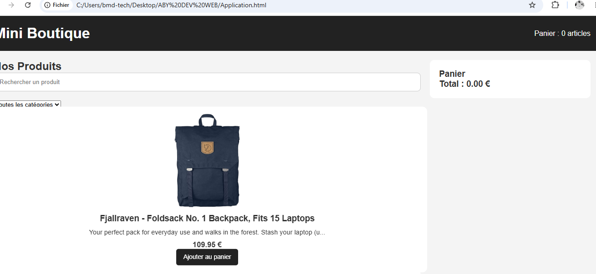
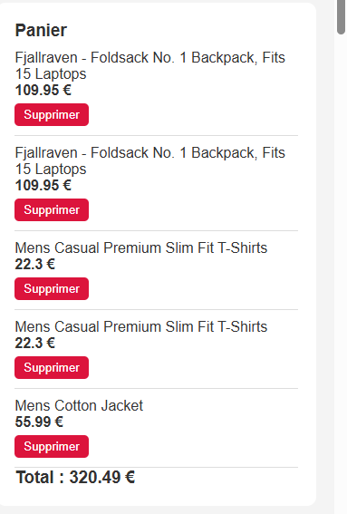

 # ABY DEV WEB - Mini Site E-commerce

##  Description
Projet de mini site e-commerce réalisé avec HTML, CSS et JavaScript.

##  Fonctionnalités
- Affichage des produits
- Ajout au panier
- Suppression de produits
- Interface simple et responsive

##  Technologies utilisées
- HTML
- CSS
- JavaScript
- Git et GitHub

## Auteur
ABY DEV WEB

##  Collaboration
Projet réalisé en équipe avec des collaborateurs via GitHub.
## Captures d’écran

### Accueil

### Nos produits

### Panier
